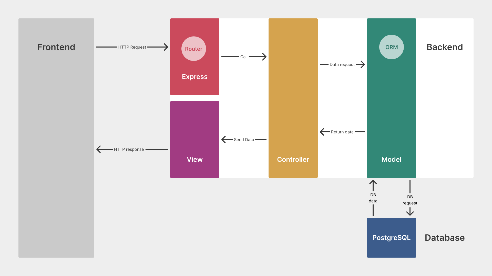
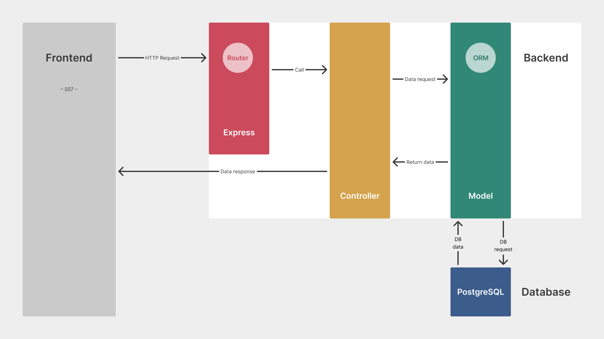

# S06E01 – API & AJAX

## Menu du jour

### Matin

- Architecture client-serveur
- API
- Découverte AJAX / `fetch`

### Après-midi

- MCD
- _User stories_
- _Wireframes_
- MCD/MLD
- Model Sequelize

## Architecture

### Architecture monolithique

> c'est ce qu'on fait depuis la S03

L'ensemble de notre application est conçu comme une seule unité :
c'est le serveur qui fait tout le boulot !



- le client demande une page au serveur (Express)
- le serveur par l'intermédiaire du **routeur** appelle le bon **contrôleur**
- qui se charge de récupérer les données en **BDD** via le **modèle**
- une fois récupérées, les données sont envoyées à la **vue**
- le HTML généré est renvoyé au client

On parle de _Server Side Rendering_ (SSR) : le rendu est généré côté serveur.

#### Avantages

- **simplicité** : l'architecture est directe → 1 seul serveur
- **SEO** : renvoie la structure de la page et son CONTENU → bon référencement
- **chargement des pages** : un seul appel HTTP pour récupérer le HTML avec son contenu

#### Inconvénients

- **peu de dynamisme** côté front :  
  ex : créer un apprenant dans le trombinoclock
  → on est obligé de _redirect_ et de recharger toutes les données

- **performance** : le serveur back s'occupe du rendu, qui peut prendre du temps
  ex : `res.render` prend du temps (des ressources RAM)

- **maintenance** se complexifie au fur et à mesure que l'application grossit

### Architecture client-serveur

(API + SPA)

> c'est ce qu'on va mettre en place en S06 et S07

Notre application est répartie en 2 entités :

1. le client qui demande des ressources et se charge de les rendre  
   → CSR (Client Side Rendering)

2. le serveur fournit les ressources (en réponse aux demandes client)



#### Avantages

- **SoC** : séparation claire du code _frontend_ et code _backend_  
  → meilleure modularisation du code  
  → une équipe se charge du front (React), l'autre du back (Data)

- **dynamisme** : évite le rechargement constant de page (SPA)  
  → mises à jour dynamiques de la page directement en JS

- facilite l'ajout de **nouveaux clients**  
  → mobile et desktop consomment la même API pour récupérer les données

#### Inconvénients

- **architecture plus lourde** : plus longue à mettre en place
  → plus de configuration probablement

- attention à la **sécurité** → bien protéger son API

- **SEO** : on renvoie une « coquille vide »  
  → potentiellement référencement très mauvais

- premier chargement de la page peut être un peu lourd

## API

### Résumé

_Application Programming Interface_ :
terme très large pour parler de toutes interfaces entre deux systèmes
ou couche d'abstraction logicielle

### API Web

- interface dont les données (interrogées par des requêtes) transitent
  via le protocole HTTP
- renvoie le plus souvent des données structurées (ex : `JSON`)
- peut être interrogée par différents clients
  (ex : navigateur, mobile, terminal – `curl`, logiciels –
    [Insomnia](https://insomnia.rest/),
    [Postman](https://www.postman.com/),
    VSCode [REST Client](https://marketplace.visualstudio.com/items?itemName=humao.rest-client)
  )

### Cette saison…

Cette saison on va mettre en place une API (plutôt privée) par dessus
notre BDD.

> **Intérêt**
> on protège notre BDD :
>
> - l'utilisateur ne sait pas quelle BDD on utilise (Postgres, MariaDB…)
> - on maîtrise les utilisateurs directs de la BDD (généralement nous !),
> ce qu'ils peuvent faire…

Une API peut être publique ou privée.  
Il est aussi possible de créer une API et de vendre des requêtes vers celle-ci.

Une API publique est le plus souvent en **lecture seule** : `GET` ;
nous, nous allons mettre en place une API qui met à disposition
plusieurs points d'entrée (_entrypoints_) :

- `GET /cards` : récupérer toutes les cartes
- `GET /lists` : récupérer toutes les listes
- `POST /cards` : créer une carte dans la BDD !
- `PATCH /cards/4` : modifier la carte n°4
- …

Il y aura des **conventions** sur les chemins, les « verbes », la structure
des données renvoyées…  
→ conventions REST (mais on verra tout ça en E03 !)

### Exemple

En **CURL** (dans un Terminal)

```bash
curl -v https://geo.api.gouv.fr/regions
```

Quelques exemples d'API Web :

- liste:
  - <https://github.com/public-api-lists/public-api-lists>
  - <https://github.com/public-apis/public-apis>

- API publiques :
  - <https://geo.api.gouv.fr/regions>
  - <https://adresse.data.gouv.fr/api-doc/adresse>
  - <https://www.omdbapi.com/?s=back+to+the+future&apikey=1e58f63b>
  - <https://swapi.dev/>
  
- Pour du CRUD et/ou à faire vous même :
  - https://github.com/typicode/json-server
  - https://developer.spotify.com/documentation/web-api

## AJAX

CURL, Insomnia, Postman c'est bien…
Mais nous on veut faire ça dans le navigateur avec JS si possible !!!

Pour cela, on peut utiliser **AJAX**.

**Attention** l'AJAX n'est pas un langage de programmation
mais une méthode utilisant plusieurs technologies :
c'est une _architecture informatique_.

AJAX combine :

- le DOM, pour pouvoir modifier l'information présentée en respectant sa structure
- le JS, via ses API dédiées qui servent au dialogue asynchrone avec le serveur :
  - XMLHttpRequest
  - Fetch
- un format de données, initialement XML (d'où le nom), dorénavant JSON

> Slides [AJAX](http://localhost:1234/s6/ajax)

- Slide « AJAX » (2) → [Fetch API](https://caniuse.com/mdn-api_fetch)

    Syntaxe :

    ```text
    const fetchPromise = fetch(resource, requestParameters);
    ```

    Avec `then/catch`

    ```js
    function getData() {
      fetch('https://geo.api.gouv.fr/regions')
        .then((response) => response.json()) // transforme la Response en JSON
        .then((data) => console.log(data));
        .catch((error) => console.error(`Oops! ${error}`));
    }

    getData();
    ```

    Avec `async/await`

    ```js
    async function getData() {
      const response = await fetch('https://geo.api.gouv.fr/regions');
      const data = await response.json(); // transforme la Response en JSON
      console.log(data);
    }

    getData();
    ```

Essayons ça ! (voir [france.html](../sandbox/france.html))

## Challenge

> fichier `__docs/challenges/C01.md`

### Issues

<https://github.com/O-clock-Muffin/Soutien-ateliers>
