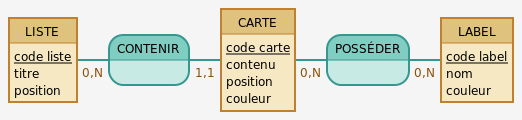
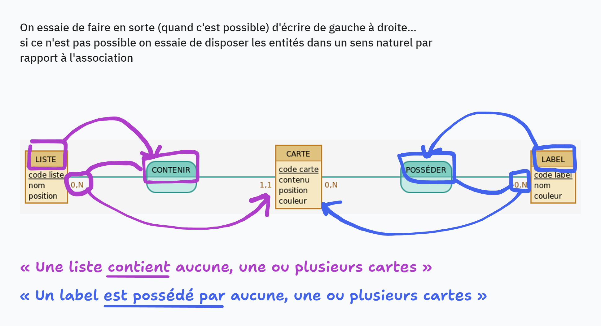

# MCD - Modèle Conceptuel de Données

> une modélisation peut tout à fait se discuter et être modifiée

## Rappel

La démarche MCD → MLD → MPD est **une méthodologie** de modélisation
de données appelée « MERISE ».

Le `MCD` répond à la question : **« Que va-t-on stocker ? »**

- « conception », pour clarifier le besoin  
  → on peut le traduire en Français (entrainez-vous, c'est souvent demandé au TP)
- exercice très **académique** (franco-français)
- très normalisé

Le `MLD` répond à la question : **« Comment va-t-on stocker ? »**

- « logique » → pour les pros
- plus souple sur le format attendu

Le `MPD` répond à la question : **« Comment va-t-on l'implémenter en BDD ? »**

« physique » → pour le SGBD / Postgres

> <https://louisvandevelde.be/index.php?dos=my&fic=meris>

## Préparation

On ressort les infos importantes de notre CDC…  

### Entités

1. on a des **listes** avec chacune un `titre` et une `position`
2. on a des **cartes** avec chacune un `contenu`, une `position`, une `couleur`
3. on a des **labels** avec chacun un `nom` et une `couleur`

### Associations

1. Liste/Carte

    - une **liste** CONTENIR _aucune, une ou plusieurs_ **carte**
    - une **carte** EST CONTENUE dans _une et une seule_ **liste**

2. Carte/Label

    - une **carte** POSSÉDER _aucun, un ou plusieurs_ **label**
    - un **label** est POSSÉDÉ par _aucune, une ou plusieurs_ **carte**
  
> les associations sont des **verbes** à l'infinitif,
> on ouvre son dictionnaire de synonymes et on évite de
> multiplier les « AVOIR »…

### Discriminant

Le discriminant c'est l'attribut qui caractérise de manière **unique** une entité.

Quand aucun attribut ne peut faire office de discriminant,
on en rajoute un  
→ exemple : « code liste »

> on ne parle pas d'ID dans MCD !

### Choix entité à part ou attribut ?

Dans certains cas, on va se questionner pour savoir si telle ou telle
information doit être une entité ou un attribut…

Exemple : la couleur  

- on l'utilise dans carte et dans label…
- est-elle imposée (seulement X couleurs possibles) ? ou libre ?

Selon les réponses à ces questions et/ou à la préférence du concepteur,
on pourra l'ajouter comme attribut aux entités ou en faire une entité
(et faire les associations).

> **ATTENTION** très souvent le choix entre entité et attribut provoque
> un choix fonctionnel lors du développement (« implication fonctionnelle ») :
>
> - attribut → simple `input`
> - entité → `select` avec les différentes couleurs possibles  
>   → ce qui implique que ces couleurs doivent être stockées en BDD

## Mise en place

Avec [Mocodo](https://www.mocodo.net/) :

```text
LISTE: code liste, titre, position
CONTENIR, 0N LISTE, 11 CARTE
CARTE: code carte, contenu, position, couleur
POSSÉDER, 0N CARTE, 0N LABEL
LABEL: code label, nom, couleur
```

ou

```text
LISTE: code liste, titre, position
CONTENIR, 0N LISTE, 11 CARTE

:
CARTE: code carte, contenu, position, couleur

:
POSSÉDER, 0N CARTE, 0N LABEL
LABEL: code label, nom, couleur
```

## Rendu





## Vocabulaire

MCD = conceptuel = pas technique

- pas d'ID ni de clé primaire mais un **discriminant**
- pas de table mais des **entités**
- pas de colonne mais des **attributs**
- pas de table de liaison ni de clés étrangères mais des
  **associations** régies par une **cardinalité**
