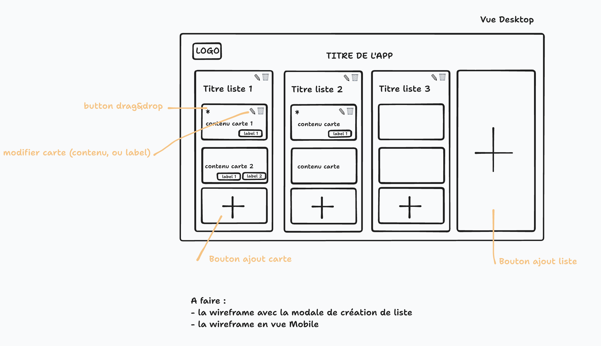

# Wireframes

schéma  « fonctionnel » dans le sens où on comprend comment se servir de l'application.

**Objectif :** clarifier le besoin et l'expérience utilisateur → dégrossir l'interface

Généralement :

- en noir et blanc
- pas d'image (rectangles barrés à la place)
- …

Différence :

- **Wireframe** : schéma fonctionnel basique
- **Mockup** : schéma design « propre » (quasiment l'intégration)
- **Prototype** : V.0 du projet (dynamique)

## Outils

Les armes de poings :

- papier / crayon
- tldraw
- Excalidraw
- Draw.io
- Balsamiq
- wireframe.cc
- Canvas

Les armes lourdes :

- Figma
- Adobe XD
- Whimsical

## Exemples

